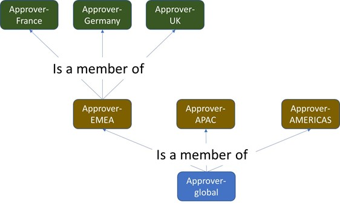
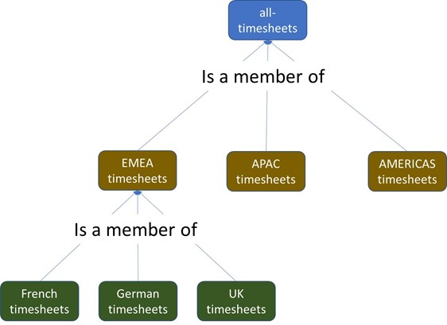

# Advanced strategy - adding role hierarchies

Some customers might want to create hierarchies of roles. This requires closer examination because things might not work exactly how you’d expect them to. 

Let’s assume that we want to create an approver role hierarchy for our timesheet management application. 

At the top of that hierarchy is the `Approver-global` role. Anyone assigned to this role can approve any timesheet anywhere. Beneath that are the regional approver roles. `Approver-EMEA`, `Approver-APAC`, and `Approver-AMERICAS`. Principals assigned to these roles can approve all timesheets in only that region. Beneath these regional approver roles are country level approver roles.

## Approach 1a managing roles using groups, with  resource specific roles 

At first sight, you might think that you’d construct a group hierarchy to represent your role hierarchy, by making `Approver-France`, `Approver-Germany`, `Approver-UK`  all members of `Approver-EMEA`, which is then a member of `Approver-Global`. 

However, this doesn't work the way you expect. If you make `Alice` a member of `Approver-Global`, she isn't a member of `Approver-UK`, and therefore can't approve UK timesheets. This struture actually grants permissionsthe other way around. If `Alice` is a member of `Approver-UK` then she is automatically a member of `Approver-EMEA` and is granted any permissions defined for that role. Because she is a member of `Approver-EMEA` she then is automatically a member of `Approver-Global` and unexpectedly has permissions to approve any timesheet anywhere. The lower in the hierarchy you are, the more groups you are a member of, and therefore the more permissions you have. This can be counter-intuitive. You actually need to construct an ***inverted*** hierarchy to achieve the expected results. 

To do this, make `Approval-Global` a member of every regional group, such as `Approver-EMEA`. Then, make each regional group a member of the appropriate country groups, such as making `Approver-EMEA` a member of `Approver-UK`, `Approver-France`, and so on.


With this inverted hierarchy in place we now get the results we expect. We can assign `Alice` to the role of `Approver-Global` by making her a member of that group, and she is authorized to approve timesheets everywhere. If you instead made `Alice` a member of the `Approver-EMEA` group, then she'd automatically be a member of each of the appropriate country approver groups. If you make `Alice` a member of only the `Approver-UK` group, then she doesn't 'inherit' any other group memberships and has permission to approve only timesheets from the UK. 

Authorization requests for this scenario must include the set of all groups that the principal is a member of. In the case of a principal that is a member of `Approver-Global`, that is going to be every approver role in the world. If our approver roles stop at the level of countries, then that might be a manageable list. However, if we have approver roles down at the level of projects then that authorization request might need to reference hundreds or even thousands of group memberships.

[comment]: <> (For more thoughts on managing permissions across group hierarchies, read ‘Org hierarchies in AVP’.) 

## Approach 1b - Role management using groups - with attributes based conditions

With this approach we replace multiple groups that represent country level roles with an attribute condition in the policy. There are no project or country level roles from which to construct a hierarchy.

One approach could be to extend our attribute-based policy that worked with projects to also permit country, regional, and global approvers. This requires us to provide a `country` attribute on the resource and then to construct the set of `assignedCountries` for the principal, based on the principal’s position in this country hierarchy.

```
# Role to approve timesheets for the principal's assigned projects
 permit (
         principal in Role::"Approver",
         action in Action::"ApproverActions",
         resource in TimesheetGrp::"all-timesheets"
) when {
   principal.assignedProjects.contains(resource.project) ||
   principal.assignedCountries.contains(resource.country)
};
```

This approach is confusing and we don't recommended it.

## Approach 2 : Role management using templates

This approach represents roles by using templates instead of groups. You assign users to roles by creating policies from the templates.  Constructing a role hierarchy doesn’t require you to define new templates, but it does require you to group your resources into a hierarchy. Fortunately, a resource hierarchy (unlike a principal hierarchy) behaves exactly as you would expect. Therefore, you would construct a hierarchy of timesheet resource groups that might look like this. 



Now, if you need to assign user `Preetha` to the role of EMEA timesheet approver, you would create a template-linked policy that looks like this.

```
# Preetha assigned the role of EMEA-approver
permit (
         principal == User::"Preetha",
         action in Action::"ApproverActions",
         resource in TimesheetGrp::"EMEA-timesheets"
)
```

This meets your requirements, but you are not explicitly modeling the role hierarchy. Cedar is not maintaining a record of which role is a member of a higher role. There is only one template, representing the approver role. 


